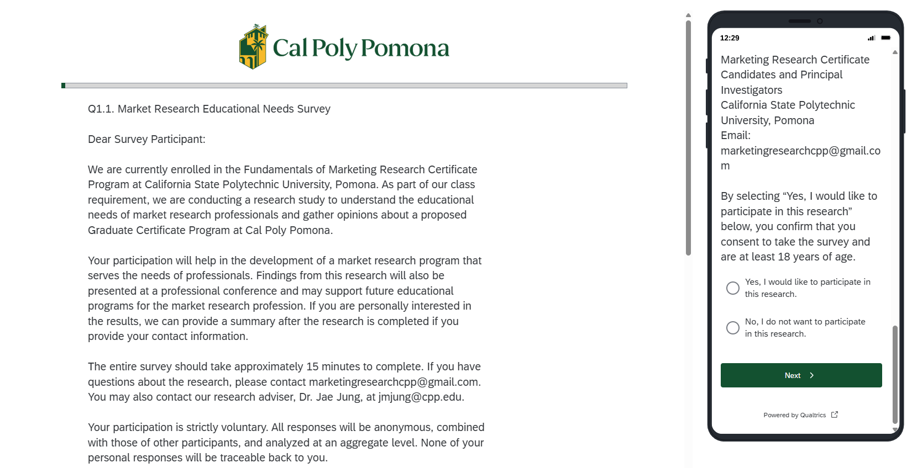
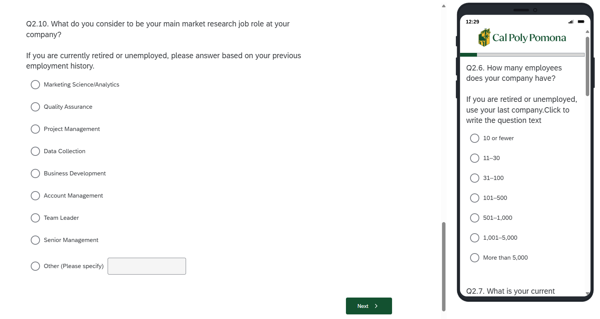
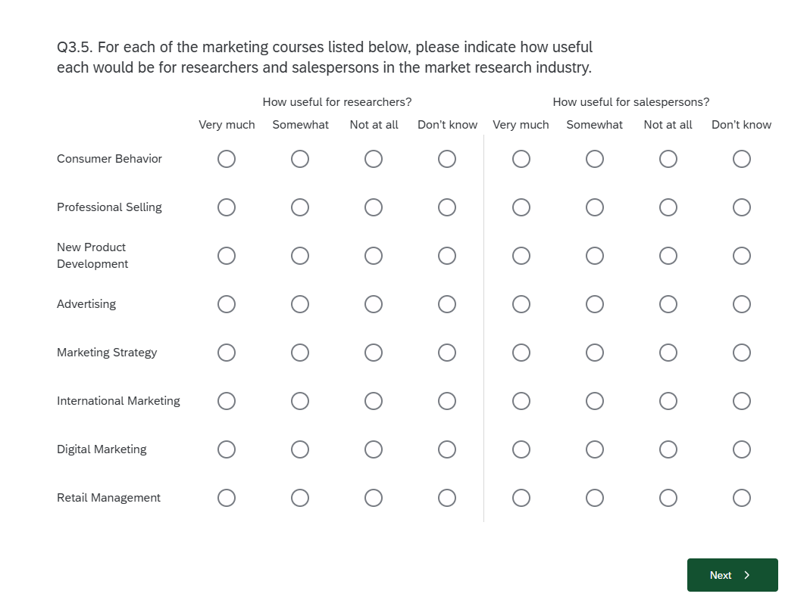
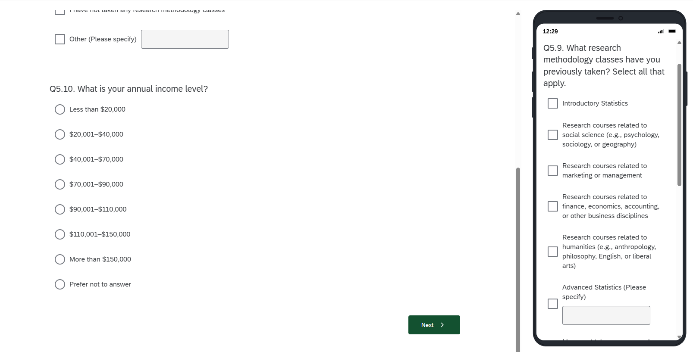
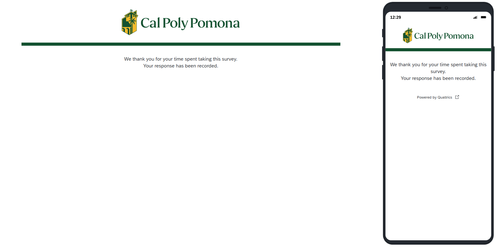
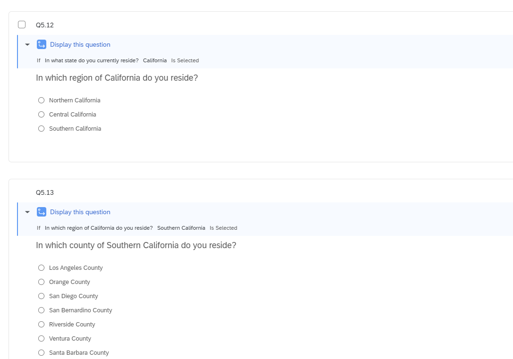
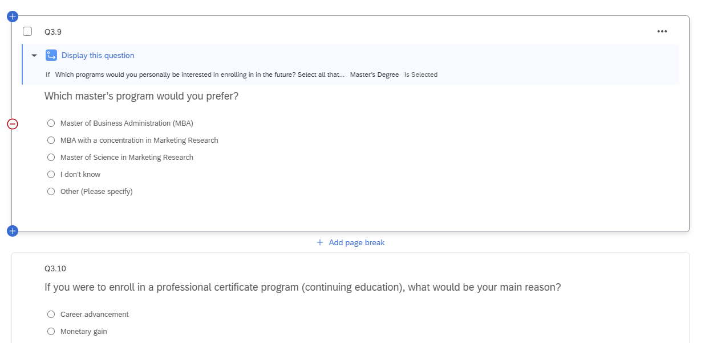
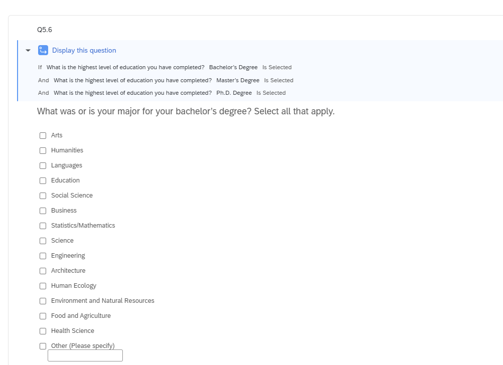

## Completed Qualtrics Survey

The screenshots below show my completed **Survey of Educational Needs for Market Research Professionals**

### Survey Introduction

{fig-alt="Qualtrics survey builder showing skip logic on the consent question." width="100%"}

{fig-alt="Desktop and mobile preview of the survey introduction and consent question." width="100%"}

### Question Design and Mobile Preview

{fig-alt="Desktop and mobile preview of employment-related survey questions." width="100%"}

{fig-alt="Preview of a side-by-side matrix question about marketing courses." width="100%"}

{fig-alt="Qualtrics builder showing display logic for a graduate-program preference question." width="100%"}

{fig-alt="Qualtrics builder showing display logic for an education-major question." width="100%"}

### Survey Preview

{fig-alt="Qualtrics builder showing regional and county display logic." width="100%"}

{fig-alt="Desktop and mobile preview of the final demographic questions." width="100%"}

{fig-alt="Desktop and mobile survey completion page." width="100%"}

## Reflection

The main challenge was transferring a detailed 56-question Word survey into Qualtrics while keeping the original wording, response choices, numbering, and five survey blocks organized. Because the survey used several formats including multiple choice, text entry, dropdown menus, and large side-by-side matrix questions. I had to choose the correct Qualtrics question type and review the formatting carefully.

Setting up the survey logic required the most attention. The consent questions needed skip logic so that respondents who did not qualify or did not consent would exit the survey. Other questions required display logic so that follow-up questions appeared only when they were relevant, such as questions about educational programs, majors, and geographic location. I tested these conditions to make sure respondents would follow the correct survey path.

Through this assignment, I became more comfortable using page breaks, validation, skip logic, display logic, text-entry options, and different question formats. Previewing the survey on both desktop and mobile helped me find layout issues and confirm that the survey remained readable on different screen sizes. Overall, I learned that building a professional survey requires careful organization, repeated testing, and close attention to the respondent’s experience.